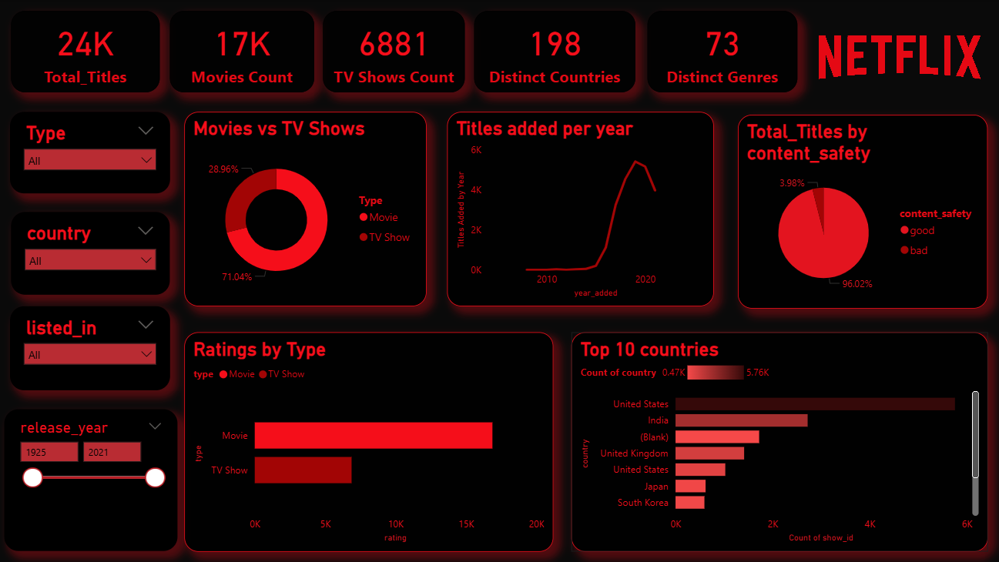

# Netflix Movies And TVShows Analysis | SQL + Power BI
---

 

---

## 📌 Table of Contents
- <a href="#Project-Overview">Project Overview</a>
- <a href="#Tools-Used">Tools Used</a>
- <a href="#Business Questions Solved (SQL)>">Business Questions Solved (SQL)</a>
- <a href="#Power-bI-Dashboard">Power-bI-Dashboard</a>
- <a href="#Results-&-Conclusion">Results & Conclusion</a>
- <a href="#Dashboard-Preview">Dashboard Preview</a>
- <a href="#Project-Structure">Project Structure</a>
- <a href="#Result-&-Conclusion">Result & Conclusion</a>
- <a href="#Author--Contact">Author & Contact</a>

---

<h2><a class =”anchor” id=”Project-Overview”></a>Project Overview</h2>

This project analyzes the Netflix movies and TV shows dataset using **SQL** for business problem-solving and **Power BI** for interactive visualization.  
The goal was to uncover insights into content trends, ratings, release patterns, and country-level distribution.

---
<h2><a class =”anchor” id=”Tools-Used”></a>Tools Used</h2>


- SQL (MySQL/PostgreSQL)  
- Power BI  
- Excel (basic cleaning)  

---
<h2><a class =”anchor” id=”Business-Questions-Solved-(SQL)”></a>Business Questions Solved (SQL)</h2>

1. Count the number of Movies vs TV Shows  
2. Find the most common rating for movies and TV shows  
3. List all movies released in a specific year (e.g., 2020)  
4. Identify the longest movie  
5. Find content added in the last 5 years  
6. Find all the movies/TV shows by director 'Rajiv Chilaka'  
7. List all TV shows with more than 5 seasons  
8. Find the year with the highest number of releases (movies + TV shows combined)  
9. List all movies that are documentaries  
10. Find all content without a director  
11. Find how many movies actor 'Salman Khan' appeared in last 10 years  
12. Find the top 5 countries with the highest number of Netflix releases  
13. Categorize content as "Good" or "Bad" based on keywords (`kill`, `violence`) in description  

---

<h2><a class =”anchor” id=”Power-bI-Dashboard></a>Power-bI-Dashboard</h2>

### **Key Visuals**
- **KPI Cards:** Total Titles, Movies Count, TV Shows Count, Distinct Countries, Distinct Genres  
- **Slicers:** Content Type, Country, Genre, Release Year  
- **Charts:**  
  - Donut: Movies vs TV Shows  
  - Stacked Bar: Ratings by Type  
  - Line Chart: Titles added per year  
  - Bar Chart: Top 10 Countries by Content Count  
  - Pie Chart: Content Safety (Good vs Bad)  

---

<h2><a class =”anchor” id=”Dashboard-Preview”></a>Dashboard Preview</h2>

 

---

<h2><a class =”anchor” id=”Project-Structure”></a>Project Structure</h2>

```

Netflix-Analytics-SQL-PowerBI/
│
├── dataset/
│   └── netflix_titles.csv      # Raw dataset (from Kaggle/Maven etc.)
│
├── sql_queries/
│   └── netflix_business_queries.sql   # 13 SQL queries solved
│
├── dashboard/
│   └── Netflix_Analytics.pbix  # Power BI dashboard file
│
├── results/
│   ├── dashboard_screenshot.png   # Screenshot of Power BI dashboard
│   └── insights_summary.pdf       # Optional: write summary of findings
│
├── README.md


```

---

<h2><a class =”anchor” id=”Results-&-Conclusion></a>Results & Conclusion</h2>

- Movies dominate the dataset compared to TV Shows.  
- The most common rating for movies is **TV-MA**, while for TV shows it's **TV-14**.  
- The USA and India contribute the most content.  
- Titles have grown significantly in the last 10 years, showing Netflix’s global expansion.  
- About **8% of titles were flagged as “Bad”** based on keyword analysis (`kill`, `violence`).  

---
<h2><a class =”anchor” id=”Author-&-Contact”></a>Author & Contact</h2>

- Author: Ashutosh Arekar
- Email: ashutosharekar02@gmail.com
- LinkedIn: https://www.linkedin.com/in/ashutosh-arekar-a837a2319/
- GitHub: https://github.com/Ashutosharekar


---

